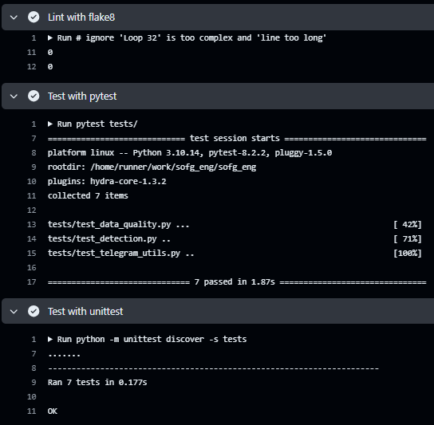

# Сервис для мониторинга и анализа состояния парковочных мест в реальном времени

[](https://github.com/GachiSlave/sofg_eng/actions/workflows/linter.yml/)
[](https://t.me/freeparkingcar_bot)
[](https://www.docker.com/)
[](https://www.jenkins.io/)

Суть проекта состоит на обнаружении, без использования масок, парковочных мест, на основе детектирования стоящих автомобилей при помощи предварительно обученной модели [YOLOv8](https://github.com/ultralytics/ultralytics). Результаты обнаружения освободившегося/занятого парковочного места оповещается при помощи Telegram-бота.

<div id="header" align="center">
  
</div>

## Документация по запуску проекта

#### 1. Клонирование репозитория:
```
git clone https://github.com/GachiSlave/sofg_eng.git
cd sofg_eng
```

#### 2. Установка зависимостей и запуск виртуальной среды:
* на Linux:
```
chmod +x install.sh
./install.sh
source venv/bin/activate
```

  * на Windows (cmd)
```
install.bat
```

#### 3. Настройка конфигурации:
Откройте файл `config.yaml`:
* Замените `chat_id` на ваш Telegram chat ID, если Вы используете свой бот, то так же замените `TOKEN`. Узнать `chat_id` интересующего чата, а так же воспользоваться готовым ботом можно при помощи [Parking space Notifier](https://t.me/freeparkingcar_bot) (при использовании `Parking space Notifier` бота `TOKEN` менять не нужно).
* В `path` вставьте путь до видео или `0` для камеры (video stream).

#### 4. Запуск проекта:
```
python main.py
```
#### 5. Запуск тестов:
Проверка модулей и качества данных.
```
pytest tests/
```
или
```
python -m unittest discover -s tests
```

[](https://git.io/typing-svg)
-------
### Над проектом работали:

* Ахаимов Данила Игоревич РИМ-130907

* Луговых Владислав Витальевич РИМ-130908

* Чудинова Алена Сергеевна РИМ-130907

* Холоденко Мария Дмитриевна РИМ-130907

-------

### Финальный проект MLOps
Были выполнены все требования к реализации проекта: 
1.	Исходные коды проекта располагаются в репозитории [GitHub](https://github.com/GachiSlave/sofg_eng/).
2.	Оркестрация проекта с помощью CI/CD Jenkins.


<details>
  <summary>Console output of build #79</summary>
  
  ```
  Started by user Холоденко Мария
[Pipeline] Start of Pipeline
[Pipeline] node
Running on Jenkins in /var/lib/jenkins/workspace/car_space
[Pipeline] {
[Pipeline] isUnix
[Pipeline] withEnv
[Pipeline] {
[Pipeline] sh
+ docker inspect -f . kurdt23/sof_eng:car
.
[Pipeline] }
[Pipeline] // withEnv
[Pipeline] withDockerContainer
Jenkins does not seem to be running inside a container
$ docker run -t -d -u 129:137 -u root:sudo -v /var/run/docker.sock:/var/run/docker.sock -w /var/lib/jenkins/workspace/car_space -v /var/lib/jenkins/workspace/car_space:/var/lib/jenkins/workspace/car_space:rw,z -v /var/lib/jenkins/workspace/car_space@tmp:/var/lib/jenkins/workspace/car_space@tmp:rw,z -e ******** -e ******** -e ******** -e ******** -e ******** -e ******** -e ******** -e ******** -e ******** -e ******** -e ******** -e ******** -e ******** -e ******** -e ******** -e ******** -e ******** -e ******** -e ******** -e ******** -e ******** -e ******** -e ******** -e ******** -e ******** -e ******** kurdt23/sof_eng:car cat
$ docker top 42a518b8b4e5667f3df60de708e7277f9756cbed60ca9a4ec420fd58d7f78897 -eo pid,comm
[Pipeline] {
[Pipeline] stage
[Pipeline] { (Start)
[Pipeline] script
[Pipeline] {
[Pipeline] echo
Начало работы скриптов
[Pipeline] }
[Pipeline] // script
[Pipeline] }
[Pipeline] // stage
[Pipeline] stage
[Pipeline] { (Checkout)
[Pipeline] script
[Pipeline] {
[Pipeline] git
The recommended git tool is: NONE
No credentials specified
Warning: JENKINS-30600: special launcher org.jenkinsci.plugins.docker.workflow.WithContainerStep$Decorator$1@52ef115f; decorates hudson.Launcher$LocalLauncher@5c28e572 will be ignored (a typical symptom is the Git executable not being run inside a designated container)
 > git rev-parse --resolve-git-dir /var/lib/jenkins/workspace/car_space/.git # timeout=10
Fetching changes from the remote Git repository
 > git config remote.origin.url https://github.com/GachiSlave/sofg_eng # timeout=10
Fetching upstream changes from https://github.com/GachiSlave/sofg_eng
 > git --version # timeout=10
 > git --version # 'git version 2.34.1'
 > git fetch --tags --force --progress -- https://github.com/GachiSlave/sofg_eng +refs/heads/*:refs/remotes/origin/* # timeout=10
 > git rev-parse refs/remotes/origin/main^{commit} # timeout=10
Checking out Revision 9b2aef0545bf3aab78f5aa06fb2c551f8b59eb13 (refs/remotes/origin/main)
 > git config core.sparsecheckout # timeout=10
 > git checkout -f 9b2aef0545bf3aab78f5aa06fb2c551f8b59eb13 # timeout=10
 > git branch -a -v --no-abbrev # timeout=10
 > git branch -D main # timeout=10
 > git checkout -b main 9b2aef0545bf3aab78f5aa06fb2c551f8b59eb13 # timeout=10
Commit message: "docker zaebal6 телега obman"
 > git rev-list --no-walk d32a2796191f9d9a854dccd4fe6e1d7ae72ddf03 # timeout=10
[Pipeline] }
[Pipeline] // script
[Pipeline] }
[Pipeline] // stage
[Pipeline] stage
[Pipeline] { (Install Dependencies)
[Pipeline] sh
+ python3 -m venv venv
[Pipeline] sh
+ . venv/bin/activate
+ deactivate nondestructive
+ [ -n  ]
+ [ -n  ]
+ [ -n  -o -n  ]
+ [ -n  ]
+ unset VIRTUAL_ENV
+ unset VIRTUAL_ENV_PROMPT
+ [ ! nondestructive = nondestructive ]
+ VIRTUAL_ENV=/var/lib/jenkins/workspace/car_space/venv
+ export VIRTUAL_ENV
+ _OLD_VIRTUAL_PATH=/usr/local/sbin:/usr/local/bin:/usr/sbin:/usr/bin:/sbin:/bin
+ PATH=/var/lib/jenkins/workspace/car_space/venv/bin:/usr/local/sbin:/usr/local/bin:/usr/sbin:/usr/bin:/sbin:/bin
+ export PATH
+ [ -n  ]
+ [ -z  ]
+ _OLD_VIRTUAL_PS1=# 
+ PS1=(venv) # 
+ export PS1
+ VIRTUAL_ENV_PROMPT=(venv) 
+ export VIRTUAL_ENV_PROMPT
+ [ -n  -o -n  ]
[Pipeline] sh
+ pip3 install flake8 dvc-gdrive numpy opencv-python-headless
Collecting flake8
  Downloading flake8-7.0.0-py2.py3-none-any.whl (57 kB)
     ━━━━━━━━━━━━━━━━━━━━━━━━━━━━━━━━━━━━━━━ 57.6/57.6 KB 287.4 kB/s eta 0:00:00
Collecting dvc-gdrive
  Downloading dvc_gdrive-3.0.1-py3-none-any.whl (11 kB)
Collecting numpy
  Downloading numpy-1.26.4-cp310-cp310-manylinux_2_17_x86_64.manylinux2014_x86_64.whl (18.2 MB)
     ━━━━━━━━━━━━━━━━━━━━━━━━━━━━━━━━━━━━━━━━ 18.2/18.2 MB 5.4 MB/s eta 0:00:00
Collecting opencv-python-headless
  Downloading opencv_python_headless-4.10.0.82-cp37-abi3-manylinux_2_17_x86_64.manylinux2014_x86_64.whl (49.9 MB)
     ━━━━━━━━━━━━━━━━━━━━━━━━━━━━━━━━━━━━━━━━ 49.9/49.9 MB 4.5 MB/s eta 0:00:00
Collecting mccabe<0.8.0,>=0.7.0
  Downloading mccabe-0.7.0-py2.py3-none-any.whl (7.3 kB)
Collecting pycodestyle<2.12.0,>=2.11.0
  Downloading pycodestyle-2.11.1-py2.py3-none-any.whl (31 kB)
Collecting pyflakes<3.3.0,>=3.2.0
  Downloading pyflakes-3.2.0-py2.py3-none-any.whl (62 kB)
     ━━━━━━━━━━━━━━━━━━━━━━━━━━━━━━━━━━━━━━━━ 62.7/62.7 KB 5.2 MB/s eta 0:00:00
Collecting dvc
  Downloading dvc-3.51.2-py3-none-any.whl (452 kB)
     ━━━━━━━━━━━━━━━━━━━━━━━━━━━━━━━━━━━━━━━ 452.6/452.6 KB 3.2 MB/s eta 0:00:00
Collecting pydrive2[fsspec]>=1.19.0
  Downloading PyDrive2-1.19.0-py3-none-any.whl (46 kB)
     ━━━━━━━━━━━━━━━━━━━━━━━━━━━━━━━━━━━━━━━━ 46.7/46.7 KB 4.1 MB/s eta 0:00:00
Collecting pyOpenSSL>=19.1.0
  Downloading pyOpenSSL-24.1.0-py3-none-any.whl (56 kB)
     ━━━━━━━━━━━━━━━━━━━━━━━━━━━━━━━━━━━━━━━━ 56.9/56.9 KB 5.5 MB/s eta 0:00:00
Collecting oauth2client>=4.0.0
  Downloading oauth2client-4.1.3-py2.py3-none-any.whl (98 kB)
     ━━━━━━━━━━━━━━━━━━━━━━━━━━━━━━━━━━━━━━━━ 98.2/98.2 KB 3.8 MB/s eta 0:00:00
Collecting google-api-python-client>=1.12.5
  Downloading google_api_python_client-2.133.0-py2.py3-none-any.whl (11.8 MB)
     ━━━━━━━━━━━━━━━━━━━━━━━━━━━━━━━━━━━━━━━━ 11.8/11.8 MB 6.0 MB/s eta 0:00:00
Collecting PyYAML>=3.0
  Downloading PyYAML-6.0.1-cp310-cp310-manylinux_2_17_x86_64.manylinux2014_x86_64.whl (705 kB)
     ━━━━━━━━━━━━━━━━━━━━━━━━━━━━━━━━━━━━━━━ 705.5/705.5 KB 6.2 MB/s eta 0:00:00
Collecting appdirs>=1.4.3
  Downloading appdirs-1.4.4-py2.py3-none-any.whl (9.6 kB)
Collecting funcy>=1.14
  Downloading funcy-2.0-py2.py3-none-any.whl (30 kB)
Collecting fsspec>=2021.07.0
  Downloading fsspec-2024.6.0-py3-none-any.whl (176 kB)
     ━━━━━━━━━━━━━━━━━━━━━━━━━━━━━━━━━━━━━━━ 176.9/176.9 KB 4.5 MB/s eta 0:00:00
Collecting tqdm>=4.0.0
  Downloading tqdm-4.66.4-py3-none-any.whl (78 kB)
     ━━━━━━━━━━━━━━━━━━━━━━━━━━━━━━━━━━━━━━━━ 78.3/78.3 KB 5.2 MB/s eta 0:00:00
Collecting pyparsing>=2.4.7
  Downloading pyparsing-3.1.2-py3-none-any.whl (103 kB)
     ━━━━━━━━━━━━━━━━━━━━━━━━━━━━━━━━━━━━━━━ 103.2/103.2 KB 6.3 MB/s eta 0:00:00
Collecting tabulate>=0.8.7
  Downloading tabulate-0.9.0-py3-none-any.whl (35 kB)
Collecting hydra-core>=1.1
  Downloading hydra_core-1.3.2-py3-none-any.whl (154 kB)
     ━━━━━━━━━━━━━━━━━━━━━━━━━━━━━━━━━━━━━━━ 154.5/154.5 KB 3.4 MB/s eta 0:00:00
Collecting packaging>=19
  Downloading packaging-24.1-py3-none-any.whl (53 kB)
     ━━━━━━━━━━━━━━━━━━━━━━━━━━━━━━━━━━━━━━━━ 54.0/54.0 KB 2.8 MB/s eta 0:00:00
Requirement already satisfied: requests>=2.22 in /usr/local/lib/python3.10/dist-packages (from dvc->dvc-gdrive) (2.32.3)
Collecting psutil>=5.8
  Downloading psutil-5.9.8-cp36-abi3-manylinux_2_12_x86_64.manylinux2010_x86_64.manylinux_2_17_x86_64.manylinux2014_x86_64.whl (288 kB)
     ━━━━━━━━━━━━━━━━━━━━━━━━━━━━━━━━━━━━━━━ 288.2/288.2 KB 5.1 MB/s eta 0:00:00
Collecting pygtrie>=2.3.2
  Downloading pygtrie-2.5.0-py3-none-any.whl (25 kB)
Collecting rich>=12
  Downloading rich-13.7.1-py3-none-any.whl (240 kB)
     ━━━━━━━━━━━━━━━━━━━━━━━━━━━━━━━━━━━━━━━ 240.7/240.7 KB 5.0 MB/s eta 0:00:00
Collecting dvc-objects
  Downloading dvc_objects-5.1.0-py3-none-any.whl (33 kB)
Collecting pathspec>=0.10.3
  Downloading pathspec-0.12.1-py3-none-any.whl (31 kB)
Collecting networkx>=2.5
  Downloading networkx-3.3-py3-none-any.whl (1.7 MB)
     ━━━━━━━━━━━━━━━━━━━━━━━━━━━━━━━━━━━━━━━━ 1.7/1.7 MB 5.0 MB/s eta 0:00:00
Collecting zc.lockfile>=1.2.1
  Downloading zc.lockfile-3.0.post1-py3-none-any.whl (9.8 kB)
Collecting platformdirs<4,>=3.1.1
  Downloading platformdirs-3.11.0-py3-none-any.whl (17 kB)
Collecting configobj>=5.0.6
  Downloading configobj-5.0.8-py2.py3-none-any.whl (36 kB)
Collecting scmrepo<4,>=3.3.4
  Downloading scmrepo-3.3.5-py3-none-any.whl (73 kB)
     ━━━━━━━━━━━━━━━━━━━━━━━━━━━━━━━━━━━━━━━━ 73.6/73.6 KB 3.8 MB/s eta 0:00:00
Collecting dvc-http>=2.29.0
  Downloading dvc_http-2.32.0-py3-none-any.whl (12 kB)
Collecting dvc-render<2,>=1.0.1
  Downloading dvc_render-1.0.2-py3-none-any.whl (22 kB)
Collecting grandalf<1,>=0.7
  Downloading grandalf-0.8-py3-none-any.whl (41 kB)
     ━━━━━━━━━━━━━━━━━━━━━━━━━━━━━━━━━━━━━━━━ 41.8/41.8 KB 2.7 MB/s eta 0:00:00
Collecting attrs>=22.2.0
  Downloading attrs-23.2.0-py3-none-any.whl (60 kB)
     ━━━━━━━━━━━━━━━━━━━━━━━━━━━━━━━━━━━━━━━━ 60.8/60.8 KB 4.8 MB/s eta 0:00:00
Collecting voluptuous>=0.11.7
  Downloading voluptuous-0.14.2-py3-none-any.whl (31 kB)
Collecting dvc-studio-client<1,>=0.20
  Downloading dvc_studio_client-0.20.0-py3-none-any.whl (16 kB)
Collecting gto<2,>=1.6.0
  Downloading gto-1.7.1-py3-none-any.whl (46 kB)
     ━━━━━━━━━━━━━━━━━━━━━━━━━━━━━━━━━━━━━━━━ 46.6/46.6 KB 3.2 MB/s eta 0:00:00
Collecting omegaconf
  Downloading omegaconf-2.3.0-py3-none-any.whl (79 kB)
     ━━━━━━━━━━━━━━━━━━━━━━━━━━━━━━━━━━━━━━━━ 79.5/79.5 KB 5.2 MB/s eta 0:00:00
Collecting ruamel.yaml>=0.17.11
  Downloading ruamel.yaml-0.18.6-py3-none-any.whl (117 kB)
     ━━━━━━━━━━━━━━━━━━━━━━━━━━━━━━━━━━━━━━━ 117.8/117.8 KB 4.5 MB/s eta 0:00:00
Collecting tomlkit>=0.11.1
  Downloading tomlkit-0.12.5-py3-none-any.whl (37 kB)
Collecting shortuuid>=0.5
  Downloading shortuuid-1.0.13-py3-none-any.whl (10 kB)
Collecting flufl.lock<8,>=5
  Downloading flufl.lock-7.1.1-py3-none-any.whl (11 kB)
Collecting dvc-data<3.16,>=3.15
  Downloading dvc_data-3.15.1-py3-none-any.whl (71 kB)
     ━━━━━━━━━━━━━━━━━━━━━━━━━━━━━━━━━━━━━━━━ 71.6/71.6 KB 1.3 MB/s eta 0:00:00
Collecting distro>=1.3
  Downloading distro-1.9.0-py3-none-any.whl (20 kB)
Collecting shtab<2,>=1.3.4
  Downloading shtab-1.7.1-py3-none-any.whl (14 kB)
Collecting iterative-telemetry>=0.0.7
  Downloading iterative_telemetry-0.0.8-py3-none-any.whl (10 kB)
Collecting kombu
  Downloading kombu-5.3.7-py3-none-any.whl (200 kB)
     ━━━━━━━━━━━━━━━━━━━━━━━━━━━━━━━━━━━━━━━ 200.2/200.2 KB 5.2 MB/s eta 0:00:00
Collecting dulwich
  Downloading dulwich-0.22.1-cp310-cp310-manylinux_2_17_x86_64.manylinux2014_x86_64.whl (979 kB)
     ━━━━━━━━━━━━━━━━━━━━━━━━━━━━━━━━━━━━━━━ 979.1/979.1 KB 5.0 MB/s eta 0:00:00
Collecting flatten-dict<1,>=0.4.1
  Downloading flatten_dict-0.4.2-py2.py3-none-any.whl (9.7 kB)
Collecting celery
  Downloading celery-5.4.0-py3-none-any.whl (425 kB)
     ━━━━━━━━━━━━━━━━━━━━━━━━━━━━━━━━━━━━━━━ 426.0/426.0 KB 5.1 MB/s eta 0:00:00
Collecting colorama>=0.3.9
  Downloading colorama-0.4.6-py2.py3-none-any.whl (25 kB)
Collecting dvc-task<1,>=0.3.0
  Downloading dvc_task-0.4.0-py3-none-any.whl (21 kB)
Collecting pydot>=1.2.4
  Downloading pydot-2.0.0-py3-none-any.whl (22 kB)
Collecting dpath<3,>=2.1.0
  Downloading dpath-2.2.0-py3-none-any.whl (17 kB)
Collecting six
  Downloading six-1.16.0-py2.py3-none-any.whl (11 kB)
Collecting diskcache>=5.2.1
  Downloading diskcache-5.6.3-py3-none-any.whl (45 kB)
     ━━━━━━━━━━━━━━━━━━━━━━━━━━━━━━━━━━━━━━━━ 45.5/45.5 KB 4.1 MB/s eta 0:00:00
Collecting sqltrie<1,>=0.11.0
  Downloading sqltrie-0.11.0-py3-none-any.whl (17 kB)
Collecting dictdiffer>=0.8.1
  Downloading dictdiffer-0.9.0-py2.py3-none-any.whl (16 kB)
Collecting aiohttp-retry>=2.5.0
  Downloading aiohttp_retry-2.8.3-py3-none-any.whl (9.8 kB)
Collecting python-dateutil>=2.8.2
  Downloading python_dateutil-2.9.0.post0-py2.py3-none-any.whl (229 kB)
     ━━━━━━━━━━━━━━━━━━━━━━━━━━━━━━━━━━━━━━━ 229.9/229.9 KB 5.0 MB/s eta 0:00:00
Collecting click-repl>=0.2.0
  Downloading click_repl-0.3.0-py3-none-any.whl (10 kB)
Collecting tzdata>=2022.7
  Downloading tzdata-2024.1-py2.py3-none-any.whl (345 kB)
     ━━━━━━━━━━━━━━━━━━━━━━━━━━━━━━━━━━━━━━━ 345.4/345.4 KB 5.6 MB/s eta 0:00:00
Collecting click<9.0,>=8.1.2
  Downloading click-8.1.7-py3-none-any.whl (97 kB)
     ━━━━━━━━━━━━━━━━━━━━━━━━━━━━━━━━━━━━━━━━ 97.9/97.9 KB 2.7 MB/s eta 0:00:00
Collecting click-plugins>=1.1.1
  Downloading click_plugins-1.1.1-py2.py3-none-any.whl (7.5 kB)
Collecting billiard<5.0,>=4.2.0
  Downloading billiard-4.2.0-py3-none-any.whl (86 kB)
     ━━━━━━━━━━━━━━━━━━━━━━━━━━━━━━━━━━━━━━━━ 86.7/86.7 KB 2.5 MB/s eta 0:00:00
Collecting vine<6.0,>=5.1.0
  Downloading vine-5.1.0-py3-none-any.whl (9.6 kB)
Collecting click-didyoumean>=0.3.0
  Downloading click_didyoumean-0.3.1-py3-none-any.whl (3.6 kB)
Collecting atpublic>=2.3
  Downloading atpublic-4.1.0-py3-none-any.whl (5.0 kB)
Collecting google-api-core!=2.0.*,!=2.1.*,!=2.2.*,!=2.3.0,<3.0.0.dev0,>=1.31.5
  Downloading google_api_core-2.19.0-py3-none-any.whl (139 kB)
     ━━━━━━━━━━━━━━━━━━━━━━━━━━━━━━━━━━━━━━━ 139.0/139.0 KB 5.1 MB/s eta 0:00:00
Collecting google-auth!=2.24.0,!=2.25.0,<3.0.0.dev0,>=1.32.0
  Downloading google_auth-2.30.0-py2.py3-none-any.whl (193 kB)
     ━━━━━━━━━━━━━━━━━━━━━━━━━━━━━━━━━━━━━━━ 193.7/193.7 KB 4.4 MB/s eta 0:00:00
Collecting google-auth-httplib2<1.0.0,>=0.2.0
  Downloading google_auth_httplib2-0.2.0-py2.py3-none-any.whl (9.3 kB)
Collecting httplib2<1.dev0,>=0.19.0
  Downloading httplib2-0.22.0-py3-none-any.whl (96 kB)
     ━━━━━━━━━━━━━━━━━━━━━━━━━━━━━━━━━━━━━━━━ 96.9/96.9 KB 4.3 MB/s eta 0:00:00
Collecting uritemplate<5,>=3.0.1
  Downloading uritemplate-4.1.1-py2.py3-none-any.whl (10 kB)
Collecting pydantic!=2.0.0,<3,>=1.9.0
  Downloading pydantic-2.7.4-py3-none-any.whl (409 kB)
     ━━━━━━━━━━━━━━━━━━━━━━━━━━━━━━━━━━━━━━━ 409.0/409.0 KB 5.3 MB/s eta 0:00:00
Collecting semver>=2.13.0
  Downloading semver-3.0.2-py3-none-any.whl (17 kB)
Collecting typer>=0.4.1
  Downloading typer-0.12.3-py3-none-any.whl (47 kB)
     ━━━━━━━━━━━━━━━━━━━━━━━━━━━━━━━━━━━━━━━━ 47.2/47.2 KB 3.0 MB/s eta 0:00:00
Collecting entrypoints
  Downloading entrypoints-0.4-py3-none-any.whl (5.3 kB)
Collecting antlr4-python3-runtime==4.9.*
  Downloading antlr4-python3-runtime-4.9.3.tar.gz (117 kB)
     ━━━━━━━━━━━━━━━━━━━━━━━━━━━━━━━━━━━━━━━ 117.0/117.0 KB 5.6 MB/s eta 0:00:00
  Preparing metadata (setup.py): started
  Preparing metadata (setup.py): finished with status 'done'
Collecting filelock
  Downloading filelock-3.15.1-py3-none-any.whl (15 kB)
Collecting amqp<6.0.0,>=5.1.1
  Downloading amqp-5.2.0-py3-none-any.whl (50 kB)
     ━━━━━━━━━━━━━━━━━━━━━━━━━━━━━━━━━━━━━━━━ 50.9/50.9 KB 1.9 MB/s eta 0:00:00
Collecting pyasn1-modules>=0.0.5
  Downloading pyasn1_modules-0.4.0-py3-none-any.whl (181 kB)
     ━━━━━━━━━━━━━━━━━━━━━━━━━━━━━━━━━━━━━━━ 181.2/181.2 KB 4.7 MB/s eta 0:00:00
Collecting rsa>=3.1.4
  Downloading rsa-4.9-py3-none-any.whl (34 kB)
Collecting pyasn1>=0.1.7
  Downloading pyasn1-0.6.0-py2.py3-none-any.whl (85 kB)
     ━━━━━━━━━━━━━━━━━━━━━━━━━━━━━━━━━━━━━━━━ 85.3/85.3 KB 4.7 MB/s eta 0:00:00
Collecting cryptography<43,>=41.0.5
  Downloading cryptography-42.0.8-cp39-abi3-manylinux_2_28_x86_64.whl (3.9 MB)
     ━━━━━━━━━━━━━━━━━━━━━━━━━━━━━━━━━━━━━━━━ 3.9/3.9 MB 5.7 MB/s eta 0:00:00
Requirement already satisfied: idna<4,>=2.5 in /usr/local/lib/python3.10/dist-packages (from requests>=2.22->dvc->dvc-gdrive) (3.7)
Requirement already satisfied: certifi>=2017.4.17 in /usr/local/lib/python3.10/dist-packages (from requests>=2.22->dvc->dvc-gdrive) (2024.6.2)
Requirement already satisfied: urllib3<3,>=1.21.1 in /usr/local/lib/python3.10/dist-packages (from requests>=2.22->dvc->dvc-gdrive) (2.2.1)
Requirement already satisfied: charset-normalizer<4,>=2 in /usr/local/lib/python3.10/dist-packages (from requests>=2.22->dvc->dvc-gdrive) (3.3.2)
Collecting pygments<3.0.0,>=2.13.0
  Downloading pygments-2.18.0-py3-none-any.whl (1.2 MB)
     ━━━━━━━━━━━━━━━━━━━━━━━━━━━━━━━━━━━━━━━━ 1.2/1.2 MB 5.7 MB/s eta 0:00:00
Collecting markdown-it-py>=2.2.0
  Downloading markdown_it_py-3.0.0-py3-none-any.whl (87 kB)
     ━━━━━━━━━━━━━━━━━━━━━━━━━━━━━━━━━━━━━━━━ 87.5/87.5 KB 3.5 MB/s eta 0:00:00
Collecting ruamel.yaml.clib>=0.2.7
  Downloading ruamel.yaml.clib-0.2.8-cp310-cp310-manylinux_2_17_x86_64.manylinux2014_x86_64.manylinux_2_24_x86_64.whl (526 kB)
     ━━━━━━━━━━━━━━━━━━━━━━━━━━━━━━━━━━━━━━━ 526.7/526.7 KB 6.1 MB/s eta 0:00:00
Collecting gitpython>3
  Downloading GitPython-3.1.43-py3-none-any.whl (207 kB)
     ━━━━━━━━━━━━━━━━━━━━━━━━━━━━━━━━━━━━━━━ 207.3/207.3 KB 7.2 MB/s eta 0:00:00
Collecting pygit2>=1.14.0
  Downloading pygit2-1.15.0-cp310-cp310-manylinux_2_17_x86_64.manylinux2014_x86_64.whl (5.1 MB)
     ━━━━━━━━━━━━━━━━━━━━━━━━━━━━━━━━━━━━━━━━ 5.1/5.1 MB 6.2 MB/s eta 0:00:00
Collecting asyncssh<3,>=2.13.1
  Downloading asyncssh-2.14.2-py3-none-any.whl (352 kB)
     ━━━━━━━━━━━━━━━━━━━━━━━━━━━━━━━━━━━━━━━ 352.5/352.5 KB 6.0 MB/s eta 0:00:00
Requirement already satisfied: setuptools in /usr/lib/python3/dist-packages (from zc.lockfile>=1.2.1->dvc->dvc-gdrive) (59.6.0)
Collecting aiohttp
  Downloading aiohttp-3.9.5-cp310-cp310-manylinux_2_17_x86_64.manylinux2014_x86_64.whl (1.2 MB)
     ━━━━━━━━━━━━━━━━━━━━━━━━━━━━━━━━━━━━━━━━ 1.2/1.2 MB 5.4 MB/s eta 0:00:00
Collecting typing-extensions>=3.6
  Downloading typing_extensions-4.12.2-py3-none-any.whl (37 kB)
Collecting prompt-toolkit>=3.0.36
  Downloading prompt_toolkit-3.0.47-py3-none-any.whl (386 kB)
     ━━━━━━━━━━━━━━━━━━━━━━━━━━━━━━━━━━━━━━━ 386.4/386.4 KB 5.3 MB/s eta 0:00:00
Collecting cffi>=1.12
  Downloading cffi-1.16.0-cp310-cp310-manylinux_2_17_x86_64.manylinux2014_x86_64.whl (443 kB)
     ━━━━━━━━━━━━━━━━━━━━━━━━━━━━━━━━━━━━━━━ 443.9/443.9 KB 5.1 MB/s eta 0:00:00
Collecting gitdb<5,>=4.0.1
  Downloading gitdb-4.0.11-py3-none-any.whl (62 kB)
     ━━━━━━━━━━━━━━━━━━━━━━━━━━━━━━━━━━━━━━━━ 62.7/62.7 KB 3.6 MB/s eta 0:00:00
Collecting googleapis-common-protos<2.0.dev0,>=1.56.2
  Downloading googleapis_common_protos-1.63.1-py2.py3-none-any.whl (229 kB)
     ━━━━━━━━━━━━━━━━━━━━━━━━━━━━━━━━━━━━━━━ 229.2/229.2 KB 4.3 MB/s eta 0:00:00
Collecting proto-plus<2.0.0dev,>=1.22.3
  Downloading proto_plus-1.23.0-py3-none-any.whl (48 kB)
     ━━━━━━━━━━━━━━━━━━━━━━━━━━━━━━━━━━━━━━━━ 48.8/48.8 KB 3.6 MB/s eta 0:00:00
Collecting protobuf!=3.20.0,!=3.20.1,!=4.21.0,!=4.21.1,!=4.21.2,!=4.21.3,!=4.21.4,!=4.21.5,<5.0.0.dev0,>=3.19.5
  Downloading protobuf-4.25.3-cp37-abi3-manylinux2014_x86_64.whl (294 kB)
     ━━━━━━━━━━━━━━━━━━━━━━━━━━━━━━━━━━━━━━━ 294.6/294.6 KB 3.1 MB/s eta 0:00:00
Collecting cachetools<6.0,>=2.0.0
  Downloading cachetools-5.3.3-py3-none-any.whl (9.3 kB)
WARNING: Retrying (Retry(total=4, connect=None, read=None, redirect=None, status=None)) after connection broken by 'ReadTimeoutError("HTTPSConnectionPool(host='pypi.org', port=443): Read timed out. (read timeout=15)")': /simple/mdurl/
Collecting mdurl~=0.1
  Downloading mdurl-0.1.2-py3-none-any.whl (10.0 kB)
Collecting pydantic-core==2.18.4
  Downloading pydantic_core-2.18.4-cp310-cp310-manylinux_2_17_x86_64.manylinux2014_x86_64.whl (2.0 MB)
     ━━━━━━━━━━━━━━━━━━━━━━━━━━━━━━━━━━━━━━━━ 2.0/2.0 MB 5.7 MB/s eta 0:00:00
Collecting annotated-types>=0.4.0
  Downloading annotated_types-0.7.0-py3-none-any.whl (13 kB)
Collecting orjson
  Downloading orjson-3.10.5-cp310-cp310-manylinux_2_17_x86_64.manylinux2014_x86_64.whl (144 kB)
     ━━━━━━━━━━━━━━━━━━━━━━━━━━━━━━━━━━━━━ 145.0/145.0 KB 405.7 kB/s eta 0:00:00
Collecting shellingham>=1.3.0
  Downloading shellingham-1.5.4-py2.py3-none-any.whl (9.8 kB)
Collecting async-timeout<5.0,>=4.0
  Downloading async_timeout-4.0.3-py3-none-any.whl (5.7 kB)
Collecting aiosignal>=1.1.2
  Downloading aiosignal-1.3.1-py3-none-any.whl (7.6 kB)
Collecting yarl<2.0,>=1.0
  Downloading yarl-1.9.4-cp310-cp310-manylinux_2_17_x86_64.manylinux2014_x86_64.whl (301 kB)
     ━━━━━━━━━━━━━━━━━━━━━━━━━━━━━━━━━━━━━━━ 301.6/301.6 KB 5.4 MB/s eta 0:00:00
Collecting frozenlist>=1.1.1
  Downloading frozenlist-1.4.1-cp310-cp310-manylinux_2_5_x86_64.manylinux1_x86_64.manylinux_2_17_x86_64.manylinux2014_x86_64.whl (239 kB)
     ━━━━━━━━━━━━━━━━━━━━━━━━━━━━━━━━━━━━━━━ 239.5/239.5 KB 5.7 MB/s eta 0:00:00
Collecting multidict<7.0,>=4.5
  Downloading multidict-6.0.5-cp310-cp310-manylinux_2_17_x86_64.manylinux2014_x86_64.whl (124 kB)
     ━━━━━━━━━━━━━━━━━━━━━━━━━━━━━━━━━━━━━ 124.3/124.3 KB 369.6 kB/s eta 0:00:00
Collecting pycparser
  Downloading pycparser-2.22-py3-none-any.whl (117 kB)
     ━━━━━━━━━━━━━━━━━━━━━━━━━━━━━━━━━━━━━━━ 117.6/117.6 KB 5.3 MB/s eta 0:00:00
Collecting smmap<6,>=3.0.1
  Downloading smmap-5.0.1-py3-none-any.whl (24 kB)
Collecting wcwidth
  Downloading wcwidth-0.2.13-py2.py3-none-any.whl (34 kB)
Building wheels for collected packages: antlr4-python3-runtime
  Building wheel for antlr4-python3-runtime (setup.py): started
  Building wheel for antlr4-python3-runtime (setup.py): finished with status 'done'
  Created wheel for antlr4-python3-runtime: filename=antlr4_python3_runtime-4.9.3-py3-none-any.whl size=144575 sha256=b398135c49225869d44d0b0dc1b9aff71ed926cb81c592cc6fb19a45d27cdbaa
  Stored in directory: /root/.cache/pip/wheels/12/93/dd/1f6a127edc45659556564c5730f6d4e300888f4bca2d4c5a88
Successfully built antlr4-python3-runtime
Installing collected packages: wcwidth, pygtrie, funcy, dictdiffer, appdirs, antlr4-python3-runtime, zc.lockfile, voluptuous, vine, uritemplate, tzdata, typing-extensions, tqdm, tomlkit, tabulate, smmap, six, shtab, shortuuid, shellingham, semver, ruamel.yaml.clib, PyYAML, pyparsing, pygments, pyflakes, pycparser, pycodestyle, pyasn1, psutil, protobuf, prompt-toolkit, platformdirs, pathspec, packaging, orjson, numpy, networkx, multidict, mdurl, mccabe, fsspec, frozenlist, filelock, entrypoints, dvc-render, dulwich, dpath, distro, diskcache, colorama, click, cachetools, billiard, attrs, atpublic, async-timeout, annotated-types, yarl, sqltrie, ruamel.yaml, rsa, python-dateutil, pydot, pydantic-core, pyasn1-modules, proto-plus, opencv-python-headless, omegaconf, markdown-it-py, iterative-telemetry, httplib2, grandalf, googleapis-common-protos, gitdb, flufl.lock, flatten-dict, flake8, dvc-studio-client, dvc-objects, configobj, click-repl, click-plugins, click-didyoumean, cffi, amqp, aiosignal, rich, pygit2, pydantic, oauth2client, kombu, hydra-core, google-auth, gitpython, dvc-data, cryptography, aiohttp, typer, pyOpenSSL, google-auth-httplib2, google-api-core, celery, asyncssh, aiohttp-retry, scmrepo, google-api-python-client, dvc-task, dvc-http, pydrive2, gto, dvc, dvc-gdrive
Successfully installed PyYAML-6.0.1 aiohttp-3.9.5 aiohttp-retry-2.8.3 aiosignal-1.3.1 amqp-5.2.0 annotated-types-0.7.0 antlr4-python3-runtime-4.9.3 appdirs-1.4.4 async-timeout-4.0.3 asyncssh-2.14.2 atpublic-4.1.0 attrs-23.2.0 billiard-4.2.0 cachetools-5.3.3 celery-5.4.0 cffi-1.16.0 click-8.1.7 click-didyoumean-0.3.1 click-plugins-1.1.1 click-repl-0.3.0 colorama-0.4.6 configobj-5.0.8 cryptography-42.0.8 dictdiffer-0.9.0 diskcache-5.6.3 distro-1.9.0 dpath-2.2.0 dulwich-0.22.1 dvc-3.51.2 dvc-data-3.15.1 dvc-gdrive-3.0.1 dvc-http-2.32.0 dvc-objects-5.1.0 dvc-render-1.0.2 dvc-studio-client-0.20.0 dvc-task-0.4.0 entrypoints-0.4 filelock-3.15.1 flake8-7.0.0 flatten-dict-0.4.2 flufl.lock-7.1.1 frozenlist-1.4.1 fsspec-2024.6.0 funcy-2.0 gitdb-4.0.11 gitpython-3.1.43 google-api-core-2.19.0 google-api-python-client-2.133.0 google-auth-2.30.0 google-auth-httplib2-0.2.0 googleapis-common-protos-1.63.1 grandalf-0.8 gto-1.7.1 httplib2-0.22.0 hydra-core-1.3.2 iterative-telemetry-0.0.8 kombu-5.3.7 markdown-it-py-3.0.0 mccabe-0.7.0 mdurl-0.1.2 multidict-6.0.5 networkx-3.3 numpy-1.26.4 oauth2client-4.1.3 omegaconf-2.3.0 opencv-python-headless-4.10.0.82 orjson-3.10.5 packaging-24.1 pathspec-0.12.1 platformdirs-3.11.0 prompt-toolkit-3.0.47 proto-plus-1.23.0 protobuf-4.25.3 psutil-5.9.8 pyOpenSSL-24.1.0 pyasn1-0.6.0 pyasn1-modules-0.4.0 pycodestyle-2.11.1 pycparser-2.22 pydantic-2.7.4 pydantic-core-2.18.4 pydot-2.0.0 pydrive2-1.19.0 pyflakes-3.2.0 pygit2-1.15.0 pygments-2.18.0 pygtrie-2.5.0 pyparsing-3.1.2 python-dateutil-2.9.0.post0 rich-13.7.1 rsa-4.9 ruamel.yaml-0.18.6 ruamel.yaml.clib-0.2.8 scmrepo-3.3.5 semver-3.0.2 shellingham-1.5.4 shortuuid-1.0.13 shtab-1.7.1 six-1.16.0 smmap-5.0.1 sqltrie-0.11.0 tabulate-0.9.0 tomlkit-0.12.5 tqdm-4.66.4 typer-0.12.3 typing-extensions-4.12.2 tzdata-2024.1 uritemplate-4.1.1 vine-5.1.0 voluptuous-0.14.2 wcwidth-0.2.13 yarl-1.9.4 zc.lockfile-3.0.post1
WARNING: Running pip as the 'root' user can result in broken permissions and conflicting behaviour with the system package manager. It is recommended to use a virtual environment instead: https://pip.pypa.io/warnings/venv
[Pipeline] }
[Pipeline] // stage
[Pipeline] stage
[Pipeline] { (Run linter flake8)
[Pipeline] sh
+ flake8 . --ignore=C901,E402,E501 --count --select=E9,F63,F7,F82 --show-source --statistics --exit-zero --max-complexity=10 --max-line-length=127
0
[Pipeline] }
[Pipeline] // stage
[Pipeline] stage
[Pipeline] { (Install DVC and Sync Data)
[Pipeline] withCredentials
Masking supported pattern matches of $gdrive
[Pipeline] {
[Pipeline] sh
+ cp **** /var/lib/jenkins/workspace/car_space
[Pipeline] }
[Pipeline] // withCredentials
[Pipeline] sh
+ dvc remote modify myremote --local gdrive_user_credentials_file gdrive.json
[Pipeline] sh
+ dvc pull
M       video.mp4
1 file modified
[Pipeline] }
[Pipeline] // stage
[Pipeline] stage
[Pipeline] { (Run Tests)
[Pipeline] sh
+ apt-get update
Hit:1 http://archive.ubuntu.com/ubuntu jammy InRelease
Hit:2 http://archive.ubuntu.com/ubuntu jammy-updates InRelease
Get:3 http://security.ubuntu.com/ubuntu jammy-security InRelease [129 kB]
Hit:4 http://archive.ubuntu.com/ubuntu jammy-backports InRelease
Fetched 129 kB in 3s (42.3 kB/s)
Reading package lists...
+ apt-get install -y libgl1
Reading package lists...
Building dependency tree...
Reading state information...
The following additional packages will be installed:
  libdrm-amdgpu1 libdrm-common libdrm-intel1 libdrm-nouveau2 libdrm-radeon1
  libdrm2 libelf1 libgl1-amber-dri libgl1-mesa-dri libglapi-mesa libglvnd0
  libglx-mesa0 libglx0 libicu70 libllvm15 libpciaccess0 libsensors-config
  libsensors5 libx11-xcb1 libxcb-dri2-0 libxcb-dri3-0 libxcb-glx0
  libxcb-present0 libxcb-randr0 libxcb-shm0 libxcb-sync1 libxcb-xfixes0
  libxfixes3 libxml2 libxshmfence1 libxxf86vm1
Suggested packages:
  pciutils lm-sensors
The following NEW packages will be installed:
  libdrm-amdgpu1 libdrm-common libdrm-intel1 libdrm-nouveau2 libdrm-radeon1
  libdrm2 libelf1 libgl1 libgl1-amber-dri libgl1-mesa-dri libglapi-mesa
  libglvnd0 libglx-mesa0 libglx0 libicu70 libllvm15 libpciaccess0
  libsensors-config libsensors5 libx11-xcb1 libxcb-dri2-0 libxcb-dri3-0
  libxcb-glx0 libxcb-present0 libxcb-randr0 libxcb-shm0 libxcb-sync1
  libxcb-xfixes0 libxfixes3 libxml2 libxshmfence1 libxxf86vm1
0 upgraded, 32 newly installed, 0 to remove and 0 not upgraded.
Need to get 50.6 MB of archives.
After this operation, 207 MB of additional disk space will be used.
Get:1 http://archive.ubuntu.com/ubuntu jammy/main amd64 libelf1 amd64 0.186-1build1 [51.0 kB]
Get:2 http://archive.ubuntu.com/ubuntu jammy/main amd64 libicu70 amd64 70.1-2 [10.6 MB]
Get:3 http://archive.ubuntu.com/ubuntu jammy-updates/main amd64 libxml2 amd64 2.9.13+dfsg-1ubuntu0.4 [763 kB]
Get:4 http://archive.ubuntu.com/ubuntu jammy-updates/main amd64 libdrm-common all 2.4.113-2~ubuntu0.22.04.1 [5450 B]
Get:5 http://archive.ubuntu.com/ubuntu jammy-updates/main amd64 libdrm2 amd64 2.4.113-2~ubuntu0.22.04.1 [38.1 kB]
Get:6 http://archive.ubuntu.com/ubuntu jammy-updates/main amd64 libdrm-amdgpu1 amd64 2.4.113-2~ubuntu0.22.04.1 [19.9 kB]
Get:7 http://archive.ubuntu.com/ubuntu jammy/main amd64 libpciaccess0 amd64 0.16-3 [19.1 kB]
Get:8 http://archive.ubuntu.com/ubuntu jammy-updates/main amd64 libdrm-intel1 amd64 2.4.113-2~ubuntu0.22.04.1 [66.7 kB]
Get:9 http://archive.ubuntu.com/ubuntu jammy-updates/main amd64 libdrm-nouveau2 amd64 2.4.113-2~ubuntu0.22.04.1 [17.5 kB]
Get:10 http://archive.ubuntu.com/ubuntu jammy-updates/main amd64 libdrm-radeon1 amd64 2.4.113-2~ubuntu0.22.04.1 [21.6 kB]
Get:11 http://archive.ubuntu.com/ubuntu jammy-updates/main amd64 libglapi-mesa amd64 23.2.1-1ubuntu3.1~22.04.2 [37.1 kB]
Get:12 http://archive.ubuntu.com/ubuntu jammy-updates/main amd64 libgl1-amber-dri amd64 21.3.9-0ubuntu1~22.04.1 [4218 kB]
Get:13 http://archive.ubuntu.com/ubuntu jammy-updates/main amd64 libllvm15 amd64 1:15.0.7-0ubuntu0.22.04.3 [25.4 MB]
Get:14 http://archive.ubuntu.com/ubuntu jammy/main amd64 libsensors-config all 1:3.6.0-7ubuntu1 [5274 B]
Get:15 http://archive.ubuntu.com/ubuntu jammy/main amd64 libsensors5 amd64 1:3.6.0-7ubuntu1 [26.3 kB]
Get:16 http://archive.ubuntu.com/ubuntu jammy/main amd64 libxcb-dri3-0 amd64 1.14-3ubuntu3 [6968 B]
Get:17 http://archive.ubuntu.com/ubuntu jammy-updates/main amd64 libgl1-mesa-dri amd64 23.2.1-1ubuntu3.1~22.04.2 [8860 kB]
Get:18 http://archive.ubuntu.com/ubuntu jammy-updates/main amd64 libx11-xcb1 amd64 2:1.7.5-1ubuntu0.3 [7802 B]
Get:19 http://archive.ubuntu.com/ubuntu jammy/main amd64 libxcb-dri2-0 amd64 1.14-3ubuntu3 [7206 B]
Get:20 http://archive.ubuntu.com/ubuntu jammy/main amd64 libxcb-glx0 amd64 1.14-3ubuntu3 [25.9 kB]
Get:21 http://archive.ubuntu.com/ubuntu jammy/main amd64 libxcb-present0 amd64 1.14-3ubuntu3 [5734 B]
Get:22 http://archive.ubuntu.com/ubuntu jammy/main amd64 libxcb-randr0 amd64 1.14-3ubuntu3 [18.3 kB]
Get:23 http://archive.ubuntu.com/ubuntu jammy/main amd64 libxcb-shm0 amd64 1.14-3ubuntu3 [5780 B]
Get:24 http://archive.ubuntu.com/ubuntu jammy/main amd64 libxcb-sync1 amd64 1.14-3ubuntu3 [9416 B]
Get:25 http://archive.ubuntu.com/ubuntu jammy/main amd64 libxcb-xfixes0 amd64 1.14-3ubuntu3 [9996 B]
Get:26 http://archive.ubuntu.com/ubuntu jammy/main amd64 libxfixes3 amd64 1:6.0.0-1 [11.7 kB]
Get:27 http://archive.ubuntu.com/ubuntu jammy/main amd64 libxshmfence1 amd64 1.3-1build4 [5394 B]
Get:28 http://archive.ubuntu.com/ubuntu jammy/main amd64 libxxf86vm1 amd64 1:1.1.4-1build3 [10.4 kB]
Get:29 http://archive.ubuntu.com/ubuntu jammy-updates/main amd64 libglx-mesa0 amd64 23.2.1-1ubuntu3.1~22.04.2 [158 kB]
Get:30 http://archive.ubuntu.com/ubuntu jammy/main amd64 libglvnd0 amd64 1.4.0-1 [73.6 kB]
Get:31 http://archive.ubuntu.com/ubuntu jammy/main amd64 libglx0 amd64 1.4.0-1 [41.0 kB]
Get:32 http://archive.ubuntu.com/ubuntu jammy/main amd64 libgl1 amd64 1.4.0-1 [110 kB]
debconf: delaying package configuration, since apt-utils is not installed
Fetched 50.6 MB in 10s (5248 kB/s)
Selecting previously unselected package libelf1:amd64.
(Reading database ... 
(Reading database ... 5%
(Reading database ... 10%
(Reading database ... 15%
(Reading database ... 20%
(Reading database ... 25%
(Reading database ... 30%
(Reading database ... 35%
(Reading database ... 40%
(Reading database ... 45%
(Reading database ... 50%
(Reading database ... 55%
(Reading database ... 60%
(Reading database ... 65%
(Reading database ... 70%
(Reading database ... 75%
(Reading database ... 80%
(Reading database ... 85%
(Reading database ... 90%
(Reading database ... 95%
(Reading database ... 100%
(Reading database ... 17299 files and directories currently installed.)
Preparing to unpack .../00-libelf1_0.186-1build1_amd64.deb ...
Unpacking libelf1:amd64 (0.186-1build1) ...
Selecting previously unselected package libicu70:amd64.
Preparing to unpack .../01-libicu70_70.1-2_amd64.deb ...
Unpacking libicu70:amd64 (70.1-2) ...
Selecting previously unselected package libxml2:amd64.
Preparing to unpack .../02-libxml2_2.9.13+dfsg-1ubuntu0.4_amd64.deb ...
Unpacking libxml2:amd64 (2.9.13+dfsg-1ubuntu0.4) ...
Selecting previously unselected package libdrm-common.
Preparing to unpack .../03-libdrm-common_2.4.113-2~ubuntu0.22.04.1_all.deb ...
Unpacking libdrm-common (2.4.113-2~ubuntu0.22.04.1) ...
Selecting previously unselected package libdrm2:amd64.
Preparing to unpack .../04-libdrm2_2.4.113-2~ubuntu0.22.04.1_amd64.deb ...
Unpacking libdrm2:amd64 (2.4.113-2~ubuntu0.22.04.1) ...
Selecting previously unselected package libdrm-amdgpu1:amd64.
Preparing to unpack .../05-libdrm-amdgpu1_2.4.113-2~ubuntu0.22.04.1_amd64.deb ...
Unpacking libdrm-amdgpu1:amd64 (2.4.113-2~ubuntu0.22.04.1) ...
Selecting previously unselected package libpciaccess0:amd64.
Preparing to unpack .../06-libpciaccess0_0.16-3_amd64.deb ...
Unpacking libpciaccess0:amd64 (0.16-3) ...
Selecting previously unselected package libdrm-intel1:amd64.
Preparing to unpack .../07-libdrm-intel1_2.4.113-2~ubuntu0.22.04.1_amd64.deb ...
Unpacking libdrm-intel1:amd64 (2.4.113-2~ubuntu0.22.04.1) ...
Selecting previously unselected package libdrm-nouveau2:amd64.
Preparing to unpack .../08-libdrm-nouveau2_2.4.113-2~ubuntu0.22.04.1_amd64.deb ...
Unpacking libdrm-nouveau2:amd64 (2.4.113-2~ubuntu0.22.04.1) ...
Selecting previously unselected package libdrm-radeon1:amd64.
Preparing to unpack .../09-libdrm-radeon1_2.4.113-2~ubuntu0.22.04.1_amd64.deb ...
Unpacking libdrm-radeon1:amd64 (2.4.113-2~ubuntu0.22.04.1) ...
Selecting previously unselected package libglapi-mesa:amd64.
Preparing to unpack .../10-libglapi-mesa_23.2.1-1ubuntu3.1~22.04.2_amd64.deb ...
Unpacking libglapi-mesa:amd64 (23.2.1-1ubuntu3.1~22.04.2) ...
Selecting previously unselected package libgl1-amber-dri:amd64.
Preparing to unpack .../11-libgl1-amber-dri_21.3.9-0ubuntu1~22.04.1_amd64.deb ...
Unpacking libgl1-amber-dri:amd64 (21.3.9-0ubuntu1~22.04.1) ...
Selecting previously unselected package libllvm15:amd64.
Preparing to unpack .../12-libllvm15_1%3a15.0.7-0ubuntu0.22.04.3_amd64.deb ...
Unpacking libllvm15:amd64 (1:15.0.7-0ubuntu0.22.04.3) ...
Selecting previously unselected package libsensors-config.
Preparing to unpack .../13-libsensors-config_1%3a3.6.0-7ubuntu1_all.deb ...
Unpacking libsensors-config (1:3.6.0-7ubuntu1) ...
Selecting previously unselected package libsensors5:amd64.
Preparing to unpack .../14-libsensors5_1%3a3.6.0-7ubuntu1_amd64.deb ...
Unpacking libsensors5:amd64 (1:3.6.0-7ubuntu1) ...
Selecting previously unselected package libxcb-dri3-0:amd64.
Preparing to unpack .../15-libxcb-dri3-0_1.14-3ubuntu3_amd64.deb ...
Unpacking libxcb-dri3-0:amd64 (1.14-3ubuntu3) ...
Selecting previously unselected package libgl1-mesa-dri:amd64.
Preparing to unpack .../16-libgl1-mesa-dri_23.2.1-1ubuntu3.1~22.04.2_amd64.deb ...
Unpacking libgl1-mesa-dri:amd64 (23.2.1-1ubuntu3.1~22.04.2) ...
Selecting previously unselected package libx11-xcb1:amd64.
Preparing to unpack .../17-libx11-xcb1_2%3a1.7.5-1ubuntu0.3_amd64.deb ...
Unpacking libx11-xcb1:amd64 (2:1.7.5-1ubuntu0.3) ...
Selecting previously unselected package libxcb-dri2-0:amd64.
Preparing to unpack .../18-libxcb-dri2-0_1.14-3ubuntu3_amd64.deb ...
Unpacking libxcb-dri2-0:amd64 (1.14-3ubuntu3) ...
Selecting previously unselected package libxcb-glx0:amd64.
Preparing to unpack .../19-libxcb-glx0_1.14-3ubuntu3_amd64.deb ...
Unpacking libxcb-glx0:amd64 (1.14-3ubuntu3) ...
Selecting previously unselected package libxcb-present0:amd64.
Preparing to unpack .../20-libxcb-present0_1.14-3ubuntu3_amd64.deb ...
Unpacking libxcb-present0:amd64 (1.14-3ubuntu3) ...
Selecting previously unselected package libxcb-randr0:amd64.
Preparing to unpack .../21-libxcb-randr0_1.14-3ubuntu3_amd64.deb ...
Unpacking libxcb-randr0:amd64 (1.14-3ubuntu3) ...
Selecting previously unselected package libxcb-shm0:amd64.
Preparing to unpack .../22-libxcb-shm0_1.14-3ubuntu3_amd64.deb ...
Unpacking libxcb-shm0:amd64 (1.14-3ubuntu3) ...
Selecting previously unselected package libxcb-sync1:amd64.
Preparing to unpack .../23-libxcb-sync1_1.14-3ubuntu3_amd64.deb ...
Unpacking libxcb-sync1:amd64 (1.14-3ubuntu3) ...
Selecting previously unselected package libxcb-xfixes0:amd64.
Preparing to unpack .../24-libxcb-xfixes0_1.14-3ubuntu3_amd64.deb ...
Unpacking libxcb-xfixes0:amd64 (1.14-3ubuntu3) ...
Selecting previously unselected package libxfixes3:amd64.
Preparing to unpack .../25-libxfixes3_1%3a6.0.0-1_amd64.deb ...
Unpacking libxfixes3:amd64 (1:6.0.0-1) ...
Selecting previously unselected package libxshmfence1:amd64.
Preparing to unpack .../26-libxshmfence1_1.3-1build4_amd64.deb ...
Unpacking libxshmfence1:amd64 (1.3-1build4) ...
Selecting previously unselected package libxxf86vm1:amd64.
Preparing to unpack .../27-libxxf86vm1_1%3a1.1.4-1build3_amd64.deb ...
Unpacking libxxf86vm1:amd64 (1:1.1.4-1build3) ...
Selecting previously unselected package libglx-mesa0:amd64.
Preparing to unpack .../28-libglx-mesa0_23.2.1-1ubuntu3.1~22.04.2_amd64.deb ...
Unpacking libglx-mesa0:amd64 (23.2.1-1ubuntu3.1~22.04.2) ...
Selecting previously unselected package libglvnd0:amd64.
Preparing to unpack .../29-libglvnd0_1.4.0-1_amd64.deb ...
Unpacking libglvnd0:amd64 (1.4.0-1) ...
Selecting previously unselected package libglx0:amd64.
Preparing to unpack .../30-libglx0_1.4.0-1_amd64.deb ...
Unpacking libglx0:amd64 (1.4.0-1) ...
Selecting previously unselected package libgl1:amd64.
Preparing to unpack .../31-libgl1_1.4.0-1_amd64.deb ...
Unpacking libgl1:amd64 (1.4.0-1) ...
Setting up libxcb-dri3-0:amd64 (1.14-3ubuntu3) ...
Setting up libx11-xcb1:amd64 (2:1.7.5-1ubuntu0.3) ...
Setting up libpciaccess0:amd64 (0.16-3) ...
Setting up libxcb-xfixes0:amd64 (1.14-3ubuntu3) ...
Setting up libglvnd0:amd64 (1.4.0-1) ...
Setting up libxcb-glx0:amd64 (1.14-3ubuntu3) ...
Setting up libsensors-config (1:3.6.0-7ubuntu1) ...
Setting up libxcb-shm0:amd64 (1.14-3ubuntu3) ...
Setting up libxxf86vm1:amd64 (1:1.1.4-1build3) ...
Setting up libxcb-present0:amd64 (1.14-3ubuntu3) ...
Setting up libxfixes3:amd64 (1:6.0.0-1) ...
Setting up libxcb-sync1:amd64 (1.14-3ubuntu3) ...
Setting up libsensors5:amd64 (1:3.6.0-7ubuntu1) ...
Setting up libglapi-mesa:amd64 (23.2.1-1ubuntu3.1~22.04.2) ...
Setting up libxcb-dri2-0:amd64 (1.14-3ubuntu3) ...
Setting up libxshmfence1:amd64 (1.3-1build4) ...
Setting up libxcb-randr0:amd64 (1.14-3ubuntu3) ...
Setting up libdrm-common (2.4.113-2~ubuntu0.22.04.1) ...
Setting up libelf1:amd64 (0.186-1build1) ...
Setting up libicu70:amd64 (70.1-2) ...
Setting up libdrm2:amd64 (2.4.113-2~ubuntu0.22.04.1) ...
Setting up libxml2:amd64 (2.9.13+dfsg-1ubuntu0.4) ...
Setting up libdrm-amdgpu1:amd64 (2.4.113-2~ubuntu0.22.04.1) ...
Setting up libdrm-nouveau2:amd64 (2.4.113-2~ubuntu0.22.04.1) ...
Setting up libdrm-radeon1:amd64 (2.4.113-2~ubuntu0.22.04.1) ...
Setting up libdrm-intel1:amd64 (2.4.113-2~ubuntu0.22.04.1) ...
Setting up libllvm15:amd64 (1:15.0.7-0ubuntu0.22.04.3) ...
Setting up libgl1-amber-dri:amd64 (21.3.9-0ubuntu1~22.04.1) ...
Setting up libgl1-mesa-dri:amd64 (23.2.1-1ubuntu3.1~22.04.2) ...
Setting up libglx-mesa0:amd64 (23.2.1-1ubuntu3.1~22.04.2) ...
Setting up libglx0:amd64 (1.4.0-1) ...
Setting up libgl1:amd64 (1.4.0-1) ...
Processing triggers for libc-bin (2.35-0ubuntu3.8) ...
[Pipeline] sh
+ python3 -m unittest discover -s /var/lib/jenkins/workspace/car_space/tests
.......
----------------------------------------------------------------------
Ran 7 tests in 1.278s

OK
[Pipeline] }
[Pipeline] // stage
[Pipeline] stage
[Pipeline] { (Build Docker Image)
[Pipeline] sh
+ apt-get install -y docker.io
Reading package lists...
Building dependency tree...
Reading state information...
The following additional packages will be installed:
  apparmor bridge-utils containerd dbus dmsetup dns-root-data dnsmasq-base
  iproute2 iptables libapparmor1 libatm1 libbpf0 libcap2-bin libdbus-1-3
  libdevmapper1.02.1 libip4tc2 libip6tc2 libmnl0 libnetfilter-conntrack3
  libnfnetlink0 libnftnl11 libpam-cap libxtables12 netcat netcat-openbsd pigz
  runc ubuntu-fan
Suggested packages:
  apparmor-profiles-extra apparmor-utils ifupdown default-dbus-session-bus
  | dbus-session-bus aufs-tools btrfs-progs cgroupfs-mount | cgroup-lite
  debootstrap docker-doc rinse zfs-fuse | zfsutils iproute2-doc firewalld kmod
  nftables
The following NEW packages will be installed:
  apparmor bridge-utils containerd dbus dmsetup dns-root-data dnsmasq-base
  docker.io iproute2 iptables libapparmor1 libatm1 libbpf0 libcap2-bin
  libdbus-1-3 libdevmapper1.02.1 libip4tc2 libip6tc2 libmnl0
  libnetfilter-conntrack3 libnfnetlink0 libnftnl11 libpam-cap libxtables12
  netcat netcat-openbsd pigz runc ubuntu-fan
0 upgraded, 29 newly installed, 0 to remove and 0 not upgraded.
Need to get 78.7 MB of archives.
After this operation, 296 MB of additional disk space will be used.
Get:1 http://archive.ubuntu.com/ubuntu jammy/universe amd64 pigz amd64 2.6-1 [63.6 kB]
Get:2 http://archive.ubuntu.com/ubuntu jammy-updates/main amd64 libapparmor1 amd64 3.0.4-2ubuntu2.3 [39.3 kB]
Get:3 http://archive.ubuntu.com/ubuntu jammy-updates/main amd64 libdbus-1-3 amd64 1.12.20-2ubuntu4.1 [189 kB]
Get:4 http://archive.ubuntu.com/ubuntu jammy-updates/main amd64 dbus amd64 1.12.20-2ubuntu4.1 [158 kB]
Get:5 http://archive.ubuntu.com/ubuntu jammy/main amd64 libdevmapper1.02.1 amd64 2:1.02.175-2.1ubuntu4 [139 kB]
Get:6 http://archive.ubuntu.com/ubuntu jammy/main amd64 dmsetup amd64 2:1.02.175-2.1ubuntu4 [81.7 kB]
Get:7 http://archive.ubuntu.com/ubuntu jammy-updates/main amd64 libbpf0 amd64 1:0.5.0-1ubuntu22.04.1 [140 kB]
Get:8 http://archive.ubuntu.com/ubuntu jammy/main amd64 libmnl0 amd64 1.0.4-3build2 [13.2 kB]
Get:9 http://archive.ubuntu.com/ubuntu jammy-updates/main amd64 libxtables12 amd64 1.8.7-1ubuntu5.2 [31.3 kB]
Get:10 http://archive.ubuntu.com/ubuntu jammy-updates/main amd64 libcap2-bin amd64 1:2.44-1ubuntu0.22.04.1 [26.0 kB]
Get:11 http://archive.ubuntu.com/ubuntu jammy/main amd64 iproute2 amd64 5.15.0-1ubuntu2 [1070 kB]
Get:12 http://archive.ubuntu.com/ubuntu jammy/main amd64 libatm1 amd64 1:2.5.1-4build2 [22.8 kB]
Get:13 http://archive.ubuntu.com/ubuntu jammy-updates/main amd64 libip4tc2 amd64 1.8.7-1ubuntu5.2 [19.9 kB]
Get:14 http://archive.ubuntu.com/ubuntu jammy-updates/main amd64 libpam-cap amd64 1:2.44-1ubuntu0.22.04.1 [7928 B]
Get:15 http://archive.ubuntu.com/ubuntu jammy/main amd64 netcat-openbsd amd64 1.218-4ubuntu1 [39.4 kB]
Get:16 http://archive.ubuntu.com/ubuntu jammy-updates/main amd64 apparmor amd64 3.0.4-2ubuntu2.3 [595 kB]
Get:17 http://archive.ubuntu.com/ubuntu jammy-updates/main amd64 libip6tc2 amd64 1.8.7-1ubuntu5.2 [20.3 kB]
Get:18 http://archive.ubuntu.com/ubuntu jammy/main amd64 libnfnetlink0 amd64 1.0.1-3build3 [14.6 kB]
Get:19 http://archive.ubuntu.com/ubuntu jammy/main amd64 libnetfilter-conntrack3 amd64 1.0.9-1 [45.3 kB]
Get:20 http://archive.ubuntu.com/ubuntu jammy/main amd64 libnftnl11 amd64 1.2.1-1build1 [65.5 kB]
Get:21 http://archive.ubuntu.com/ubuntu jammy-updates/main amd64 iptables amd64 1.8.7-1ubuntu5.2 [455 kB]
Get:22 http://archive.ubuntu.com/ubuntu jammy/main amd64 bridge-utils amd64 1.7-1ubuntu3 [34.4 kB]
Get:23 http://archive.ubuntu.com/ubuntu jammy-updates/main amd64 runc amd64 1.1.12-0ubuntu2~22.04.1 [8405 kB]
Get:24 http://archive.ubuntu.com/ubuntu jammy-updates/main amd64 containerd amd64 1.7.12-0ubuntu2~22.04.1 [37.8 MB]
Get:25 http://archive.ubuntu.com/ubuntu jammy-updates/main amd64 dns-root-data all 2023112702~ubuntu0.22.04.1 [5136 B]
Get:26 http://archive.ubuntu.com/ubuntu jammy-updates/main amd64 dnsmasq-base amd64 2.90-0ubuntu0.22.04.1 [374 kB]
Get:27 http://archive.ubuntu.com/ubuntu jammy-updates/universe amd64 docker.io amd64 24.0.7-0ubuntu2~22.04.1 [28.8 MB]
Get:28 http://archive.ubuntu.com/ubuntu jammy/universe amd64 netcat all 1.218-4ubuntu1 [2044 B]
Get:29 http://archive.ubuntu.com/ubuntu jammy/universe amd64 ubuntu-fan all 0.12.16 [35.2 kB]
debconf: delaying package configuration, since apt-utils is not installed
Fetched 78.7 MB in 13s (5949 kB/s)
Selecting previously unselected package pigz.
(Reading database ... 
(Reading database ... 5%
(Reading database ... 10%
(Reading database ... 15%
(Reading database ... 20%
(Reading database ... 25%
(Reading database ... 30%
(Reading database ... 35%
(Reading database ... 40%
(Reading database ... 45%
(Reading database ... 50%
(Reading database ... 55%
(Reading database ... 60%
(Reading database ... 65%
(Reading database ... 70%
(Reading database ... 75%
(Reading database ... 80%
(Reading database ... 85%
(Reading database ... 90%
(Reading database ... 95%
(Reading database ... 100%
(Reading database ... 17518 files and directories currently installed.)
Preparing to unpack .../00-pigz_2.6-1_amd64.deb ...
Unpacking pigz (2.6-1) ...
Selecting previously unselected package libapparmor1:amd64.
Preparing to unpack .../01-libapparmor1_3.0.4-2ubuntu2.3_amd64.deb ...
Unpacking libapparmor1:amd64 (3.0.4-2ubuntu2.3) ...
Selecting previously unselected package libdbus-1-3:amd64.
Preparing to unpack .../02-libdbus-1-3_1.12.20-2ubuntu4.1_amd64.deb ...
Unpacking libdbus-1-3:amd64 (1.12.20-2ubuntu4.1) ...
Selecting previously unselected package dbus.
Preparing to unpack .../03-dbus_1.12.20-2ubuntu4.1_amd64.deb ...
Unpacking dbus (1.12.20-2ubuntu4.1) ...
Selecting previously unselected package libdevmapper1.02.1:amd64.
Preparing to unpack .../04-libdevmapper1.02.1_2%3a1.02.175-2.1ubuntu4_amd64.deb ...
Unpacking libdevmapper1.02.1:amd64 (2:1.02.175-2.1ubuntu4) ...
Selecting previously unselected package dmsetup.
Preparing to unpack .../05-dmsetup_2%3a1.02.175-2.1ubuntu4_amd64.deb ...
Unpacking dmsetup (2:1.02.175-2.1ubuntu4) ...
Selecting previously unselected package libbpf0:amd64.
Preparing to unpack .../06-libbpf0_1%3a0.5.0-1ubuntu22.04.1_amd64.deb ...
Unpacking libbpf0:amd64 (1:0.5.0-1ubuntu22.04.1) ...
Selecting previously unselected package libmnl0:amd64.
Preparing to unpack .../07-libmnl0_1.0.4-3build2_amd64.deb ...
Unpacking libmnl0:amd64 (1.0.4-3build2) ...
Selecting previously unselected package libxtables12:amd64.
Preparing to unpack .../08-libxtables12_1.8.7-1ubuntu5.2_amd64.deb ...
Unpacking libxtables12:amd64 (1.8.7-1ubuntu5.2) ...
Selecting previously unselected package libcap2-bin.
Preparing to unpack .../09-libcap2-bin_1%3a2.44-1ubuntu0.22.04.1_amd64.deb ...
Unpacking libcap2-bin (1:2.44-1ubuntu0.22.04.1) ...
Selecting previously unselected package iproute2.
Preparing to unpack .../10-iproute2_5.15.0-1ubuntu2_amd64.deb ...
Unpacking iproute2 (5.15.0-1ubuntu2) ...
Selecting previously unselected package libatm1:amd64.
Preparing to unpack .../11-libatm1_1%3a2.5.1-4build2_amd64.deb ...
Unpacking libatm1:amd64 (1:2.5.1-4build2) ...
Selecting previously unselected package libip4tc2:amd64.
Preparing to unpack .../12-libip4tc2_1.8.7-1ubuntu5.2_amd64.deb ...
Unpacking libip4tc2:amd64 (1.8.7-1ubuntu5.2) ...
Selecting previously unselected package libpam-cap:amd64.
Preparing to unpack .../13-libpam-cap_1%3a2.44-1ubuntu0.22.04.1_amd64.deb ...
Unpacking libpam-cap:amd64 (1:2.44-1ubuntu0.22.04.1) ...
Selecting previously unselected package netcat-openbsd.
Preparing to unpack .../14-netcat-openbsd_1.218-4ubuntu1_amd64.deb ...
Unpacking netcat-openbsd (1.218-4ubuntu1) ...
Selecting previously unselected package apparmor.
Preparing to unpack .../15-apparmor_3.0.4-2ubuntu2.3_amd64.deb ...
Unpacking apparmor (3.0.4-2ubuntu2.3) ...
Selecting previously unselected package libip6tc2:amd64.
Preparing to unpack .../16-libip6tc2_1.8.7-1ubuntu5.2_amd64.deb ...
Unpacking libip6tc2:amd64 (1.8.7-1ubuntu5.2) ...
Selecting previously unselected package libnfnetlink0:amd64.
Preparing to unpack .../17-libnfnetlink0_1.0.1-3build3_amd64.deb ...
Unpacking libnfnetlink0:amd64 (1.0.1-3build3) ...
Selecting previously unselected package libnetfilter-conntrack3:amd64.
Preparing to unpack .../18-libnetfilter-conntrack3_1.0.9-1_amd64.deb ...
Unpacking libnetfilter-conntrack3:amd64 (1.0.9-1) ...
Selecting previously unselected package libnftnl11:amd64.
Preparing to unpack .../19-libnftnl11_1.2.1-1build1_amd64.deb ...
Unpacking libnftnl11:amd64 (1.2.1-1build1) ...
Selecting previously unselected package iptables.
Preparing to unpack .../20-iptables_1.8.7-1ubuntu5.2_amd64.deb ...
Unpacking iptables (1.8.7-1ubuntu5.2) ...
Selecting previously unselected package bridge-utils.
Preparing to unpack .../21-bridge-utils_1.7-1ubuntu3_amd64.deb ...
Unpacking bridge-utils (1.7-1ubuntu3) ...
Selecting previously unselected package runc.
Preparing to unpack .../22-runc_1.1.12-0ubuntu2~22.04.1_amd64.deb ...
Unpacking runc (1.1.12-0ubuntu2~22.04.1) ...
Selecting previously unselected package containerd.
Preparing to unpack .../23-containerd_1.7.12-0ubuntu2~22.04.1_amd64.deb ...
Unpacking containerd (1.7.12-0ubuntu2~22.04.1) ...
Selecting previously unselected package dns-root-data.
Preparing to unpack .../24-dns-root-data_2023112702~ubuntu0.22.04.1_all.deb ...
Unpacking dns-root-data (2023112702~ubuntu0.22.04.1) ...
Selecting previously unselected package dnsmasq-base.
Preparing to unpack .../25-dnsmasq-base_2.90-0ubuntu0.22.04.1_amd64.deb ...
Unpacking dnsmasq-base (2.90-0ubuntu0.22.04.1) ...
Selecting previously unselected package docker.io.
Preparing to unpack .../26-docker.io_24.0.7-0ubuntu2~22.04.1_amd64.deb ...
Unpacking docker.io (24.0.7-0ubuntu2~22.04.1) ...
Selecting previously unselected package netcat.
Preparing to unpack .../27-netcat_1.218-4ubuntu1_all.deb ...
Unpacking netcat (1.218-4ubuntu1) ...
Selecting previously unselected package ubuntu-fan.
Preparing to unpack .../28-ubuntu-fan_0.12.16_all.deb ...
Unpacking ubuntu-fan (0.12.16) ...
Setting up libip4tc2:amd64 (1.8.7-1ubuntu5.2) ...
Setting up libapparmor1:amd64 (3.0.4-2ubuntu2.3) ...
Setting up libip6tc2:amd64 (1.8.7-1ubuntu5.2) ...
Setting up netcat-openbsd (1.218-4ubuntu1) ...
update-alternatives: using /bin/nc.openbsd to provide /bin/nc (nc) in auto mode
update-alternatives: warning: skip creation of /usr/share/man/man1/nc.1.gz because associated file /usr/share/man/man1/nc_openbsd.1.gz (of link group nc) doesn't exist
update-alternatives: warning: skip creation of /usr/share/man/man1/netcat.1.gz because associated file /usr/share/man/man1/nc_openbsd.1.gz (of link group nc) doesn't exist
Setting up netcat (1.218-4ubuntu1) ...
Setting up libatm1:amd64 (1:2.5.1-4build2) ...
Setting up runc (1.1.12-0ubuntu2~22.04.1) ...
Setting up dns-root-data (2023112702~ubuntu0.22.04.1) ...
Setting up libcap2-bin (1:2.44-1ubuntu0.22.04.1) ...
Setting up apparmor (3.0.4-2ubuntu2.3) ...
debconf: unable to initialize frontend: Dialog
debconf: (TERM is not set, so the dialog frontend is not usable.)
debconf: falling back to frontend: Readline
Setting up libdbus-1-3:amd64 (1.12.20-2ubuntu4.1) ...
Setting up dbus (1.12.20-2ubuntu4.1) ...
Setting up libmnl0:amd64 (1.0.4-3build2) ...
Setting up libxtables12:amd64 (1.8.7-1ubuntu5.2) ...
Setting up bridge-utils (1.7-1ubuntu3) ...
debconf: unable to initialize frontend: Dialog
debconf: (TERM is not set, so the dialog frontend is not usable.)
debconf: falling back to frontend: Readline
Setting up libdevmapper1.02.1:amd64 (2:1.02.175-2.1ubuntu4) ...
Setting up dmsetup (2:1.02.175-2.1ubuntu4) ...
Setting up pigz (2.6-1) ...
Setting up libnfnetlink0:amd64 (1.0.1-3build3) ...
Setting up libbpf0:amd64 (1:0.5.0-1ubuntu22.04.1) ...
Setting up containerd (1.7.12-0ubuntu2~22.04.1) ...
Setting up libpam-cap:amd64 (1:2.44-1ubuntu0.22.04.1) ...
debconf: unable to initialize frontend: Dialog
debconf: (TERM is not set, so the dialog frontend is not usable.)
debconf: falling back to frontend: Readline
Setting up iproute2 (5.15.0-1ubuntu2) ...
debconf: unable to initialize frontend: Dialog
debconf: (TERM is not set, so the dialog frontend is not usable.)
debconf: falling back to frontend: Readline
Setting up libnftnl11:amd64 (1.2.1-1build1) ...
Setting up libnetfilter-conntrack3:amd64 (1.0.9-1) ...
Setting up iptables (1.8.7-1ubuntu5.2) ...
update-alternatives: using /usr/sbin/iptables-legacy to provide /usr/sbin/iptables (iptables) in auto mode
update-alternatives: using /usr/sbin/ip6tables-legacy to provide /usr/sbin/ip6tables (ip6tables) in auto mode
update-alternatives: using /usr/sbin/iptables-nft to provide /usr/sbin/iptables (iptables) in auto mode
update-alternatives: using /usr/sbin/ip6tables-nft to provide /usr/sbin/ip6tables (ip6tables) in auto mode
update-alternatives: using /usr/sbin/arptables-nft to provide /usr/sbin/arptables (arptables) in auto mode
update-alternatives: using /usr/sbin/ebtables-nft to provide /usr/sbin/ebtables (ebtables) in auto mode
Setting up docker.io (24.0.7-0ubuntu2~22.04.1) ...
debconf: unable to initialize frontend: Dialog
debconf: (TERM is not set, so the dialog frontend is not usable.)
debconf: falling back to frontend: Readline
Adding group `docker' (GID 103) ...
Done.
invoke-rc.d: unknown initscript, /etc/init.d/docker not found.
invoke-rc.d: could not determine current runlevel
Setting up dnsmasq-base (2.90-0ubuntu0.22.04.1) ...
Setting up ubuntu-fan (0.12.16) ...
invoke-rc.d: could not determine current runlevel
invoke-rc.d: policy-rc.d denied execution of start.
Processing triggers for libc-bin (2.35-0ubuntu3.8) ...
Processing triggers for dbus (1.12.20-2ubuntu4.1) ...
[Pipeline] sh
+ dockerd-entrypoint.sh
/var/lib/jenkins/workspace/car_space@tmp/durable-147091a2/script.sh.copy: 1: dockerd-entrypoint.sh: not found
[Pipeline] sh
+ sleep 10
[Pipeline] withCredentials
Masking supported pattern matches of $PASSWORD
[Pipeline] {
[Pipeline] sh
Warning: A secret was passed to "sh" using Groovy String interpolation, which is insecure.
		 Affected argument(s) used the following variable(s): [PASSWORD]
		 See https://jenkins.io/redirect/groovy-string-interpolation for details.
+ docker login -u organismus22@gmail.com --password-stdin
+ echo ****
WARNING! Your password will be stored unencrypted in /root/.docker/config.json.
Configure a credential helper to remove this warning. See
https://docs.docker.com/engine/reference/commandline/login/#credentials-store

Login Succeeded
[Pipeline] }
[Pipeline] // withCredentials
[Pipeline] sh
+ docker build -t kurdt23/sof_eng:car .
DEPRECATED: The legacy builder is deprecated and will be removed in a future release.
            Install the buildx component to build images with BuildKit:
            https://docs.docker.com/go/buildx/

Sending build context to Docker daemon  2.612GB

Step 1/12 : FROM ubuntu:22.04
 ---> 67c845845b7d
Step 2/12 : LABEL maintainer="organismus22@gmail.com"
 ---> Using cache
 ---> 7e0d4b96e514
Step 3/12 : LABEL version="1.0"
 ---> Using cache
 ---> 47f62f2a13bc
Step 4/12 : LABEL description="docker agent for jenkins"
 ---> Using cache
 ---> 51c20846a642
Step 5/12 : ARG DEBIAN_FRONTEND=noninteractive
 ---> Using cache
 ---> 998361769dfa
Step 6/12 : RUN apt update && apt-get install -y   git   python3   python3-venv   python3-pip   && apt-get clean
 ---> Using cache
 ---> 9ba2ebd76509
Step 7/12 : RUN pip3 install --no-cache-dir requests
 ---> Using cache
 ---> 935409c3fdcd
Step 8/12 : RUN useradd -ms /bin/bash Jenkins
 ---> Using cache
 ---> e5e64eafd721
Step 9/12 : USER Jenkins
 ---> Using cache
 ---> b567012cbe44
Step 10/12 : WORKDIR /home/Jenkins
 ---> Using cache
 ---> e088a403ff6a
Step 11/12 : COPY . .
 ---> f2deb2853dbf
Step 12/12 : CMD ["python3", "telegram_utils.py"]
 ---> Running in c4e2907344aa
 ---> Removed intermediate container c4e2907344aa
 ---> 6d8c221d68f6
Successfully built 6d8c221d68f6
Successfully tagged kurdt23/sof_eng:car
[Pipeline] }
[Pipeline] // stage
[Pipeline] stage
[Pipeline] { (Update Config)
[Pipeline] withCredentials
Masking supported pattern matches of $YOUR_CHAT_ID
[Pipeline] {
[Pipeline] sh
Warning: A secret was passed to "sh" using Groovy String interpolation, which is insecure.
		 Affected argument(s) used the following variable(s): [YOUR_CHAT_ID]
		 See https://jenkins.io/redirect/groovy-string-interpolation for details.
+ sed -i s/chat_id:.*/chat_id: "****"/ config.yaml
[Pipeline] }
[Pipeline] // withCredentials
[Pipeline] }
[Pipeline] // stage
[Pipeline] stage
[Pipeline] { (Run Python Script)
[Pipeline] sh
+ docker run --rm kurdt23/sof_eng:car
[Pipeline] }
[Pipeline] // stage
[Pipeline] stage
[Pipeline] { (Push Docker Image)
[Pipeline] sh
+ docker push kurdt23/sof_eng:car
The push refers to repository [docker.io/kurdt23/sof_eng]
c0e83e2c76dc: Preparing
f1652e0c5a26: Preparing
5187c3072ee4: Preparing
44e44a3b1701: Preparing
0b9c994b0484: Preparing
0b9c994b0484: Layer already exists
f1652e0c5a26: Pushed
5187c3072ee4: Pushed
44e44a3b1701: Pushed
c0e83e2c76dc: Pushed
car: digest: sha256:6807fe9a465a34120dadb7c174a4bee6b9b66593bb3f431776df130dffaa0ddf size: 1374
[Pipeline] }
[Pipeline] // stage
[Pipeline] stage
[Pipeline] { (Finish)
[Pipeline] script
[Pipeline] {
[Pipeline] echo
Работа скриптов завершена успешно
[Pipeline] }
[Pipeline] // script
[Pipeline] }
[Pipeline] // stage
[Pipeline] }
$ docker stop --time=1 42a518b8b4e5667f3df60de708e7277f9756cbed60ca9a4ec420fd58d7f78897
$ docker rm -f --volumes 42a518b8b4e5667f3df60de708e7277f9756cbed60ca9a4ec420fd58d7f78897
[Pipeline] // withDockerContainer
[Pipeline] }
[Pipeline] // node
[Pipeline] End of Pipeline
Finished: SUCCESS
  ```
</details>

3.	Наборы данных версионируются с помощью dvc и синхронизируются с удалённым хранилищем.


4.	Рефакторинг выполнен в отдельных [ветках](https://github.com/GachiSlave/sofg_eng/branches).
5.	В конвейере Jenkins запускаются модульные тесты и проверка тестами на качество данных.


6.	Итоговое приложение реализуется в виде Docker образа. Сборка образа происходит в конвейере Jenkins.


7.	В проекте используется предварительно обученная модель [YOLOv8](https://github.com/ultralytics/ultralytics).

#### Бонус GitHub Actions

Так же выполняется проверка качества кода и запуск тестов через [GitHub Actions](https://github.com/GachiSlave/sofg_eng/actions/workflows/linter.yml).


